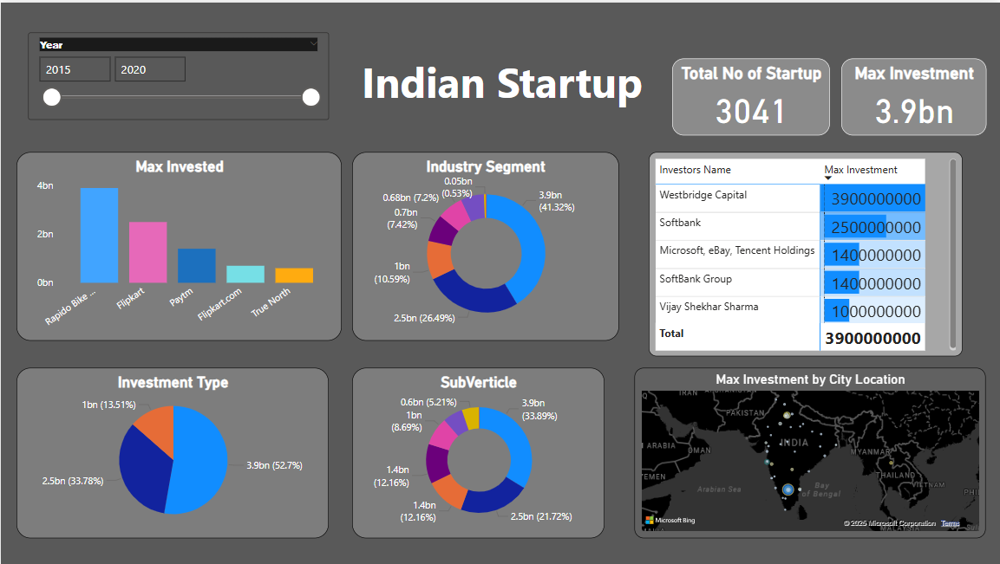

# Indian Startup Dashboard Insights

## Overview
This dashboard provides a comprehensive analysis of the Indian startup ecosystem, focusing on investments from 2015 to 2020. It highlights key metrics, investment trends, industry segments, and geographical distribution, offering valuable insights into the evolving startup landscape.

## Key Questions Addressed
1. **How have investments in Indian startups evolved over time from 2015 to 2020?**
2. **Which companies received the highest investments during this period?**
3. **What are the leading industry segments and sub-verticals attracting significant funding?**
4. **Who are the major investors, and how much have they invested?**
5. **Which cities in India are receiving the largest investments?**
6. **What are the dominant investment types in the startup ecosystem?**

## Key Insights

### 1. Investment in Companies
- **Top Funded Startups**: 
  - Rapido Bike leads with investments reaching ~4 billion.
  - Other significant recipients include Flipkart (~2.5 billion), Paytm (~1.5 billion), and True North (~0.5 billion).

### 2. Industry Segment Trends
- The industry distribution reveals:
  - **Largest Segment**: ~41.32% of total investments (~3.9 billion).
  - Subsequent Segments: 26.49% (~2.5 billion), 10.59% (~1 billion), and smaller proportions among other categories.

### 3. Geographical Distribution
- **Top Cities**: Maximum investments are concentrated in prominent cities, with locations displayed on the map for better visualization of funding hotspots.

### 4. Major Investors
- **Leading Investors**:
  - Westbridge Capital: 3.9 billion.
  - SoftBank: 2.5 billion.
  - Microsoft, eBay, Tencent Holdings: 1.4 billion (collectively).
  - Vijay Shekhar Sharma: 10 million.

### 5. Investment Types
- **Breakdown by Types**:
  - The dominant type accounts for ~52.7% (~3.9 billion), followed by 33.78% (~2.5 billion) and smaller shares.

### 6. Sub-Vertical Insights
- **Key Sub-Verticals**:
  - The leading sub-vertical receives ~33.89% (~3.9 billion), while others range from 8.69% (~1 billion) to smaller shares among various categories.

## Features
- **Time Range Filter**: Filter data by specific years (2015–2020) to observe trends over time.
- **Interactive Visualizations**: Explore bar charts, pie charts, and maps for a clearer understanding of investment dynamics.
- **Dynamic Filtering**: Segment data by key attributes such as company, industry segment, sub-vertical, and location.

## Data Analyst’s Guide
1. **Explore Trends**: Utilize charts and filters to track funding patterns across years and sectors.
2. **Identify Leaders**: Analyze top-performing companies, cities, and investors based on funding data.
3. **Drill Down**: Use sub-vertical and industry filters to uncover niche insights.
4. **Actionable Insights**: Leverage the data for reporting, strategic planning, and market evaluations.

## Conclusion
The Indian Startup Dashboard is a powerful tool for understanding the investment landscape, highlighting key players, sectors, and regions. It supports data-driven decision-making for analysts, investors, and stakeholders seeking opportunities in India’s vibrant startup ecosystem.
